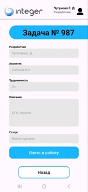
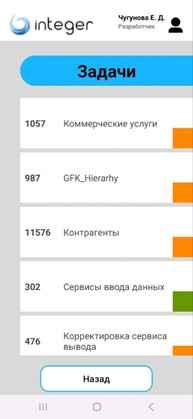
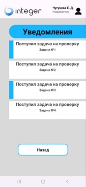
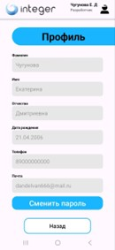

# Integer

## Описание приложения
Приложение «Integer» предназначено для сотрудников компании ООО «Интеджер».  
Оно используется для управления рабочими задачами и взаимодействия с системой уведомлений.

Основной функционал приложения:
- просмотр списка задач сотрудника
- просмотр уведомлений
- управление профилем
- смена пароля учетной записи

## Авторизация
При запуске приложения открывается форма входа.  
Пользователь должен ввести:
- логин
- пароль  

После этого нажать кнопку **«Войти»**.

---

## Главное меню
После входа отображается главное меню, где:
- в правом верхнем углу указаны ФИО и должность сотрудника
- доступны разделы:
  - **Уведомления**
  - **Задачи**
  - **Профиль**

---

## Управление задачами
В разделе **«Задачи»** пользователь может:
- просматривать список задач
- видеть статус каждой задачи
---

### Действия с задачами:
- взять задачу в работу
- завершить задачу (передать на тестирование)
- просмотреть подробную информацию:
  - разработчик
  - аналитик
  - трудоёмкость
  - описание

---

## Уведомления
Раздел **«Уведомления»** содержит:
- сообщения о задачах
- изменения статусов
- изменения профиля

Непрочитанные уведомления выделяются синей полосой.

---

## Профиль
В профиле доступны:
- ФИО
- дата рождения
- email
- телефон

---

